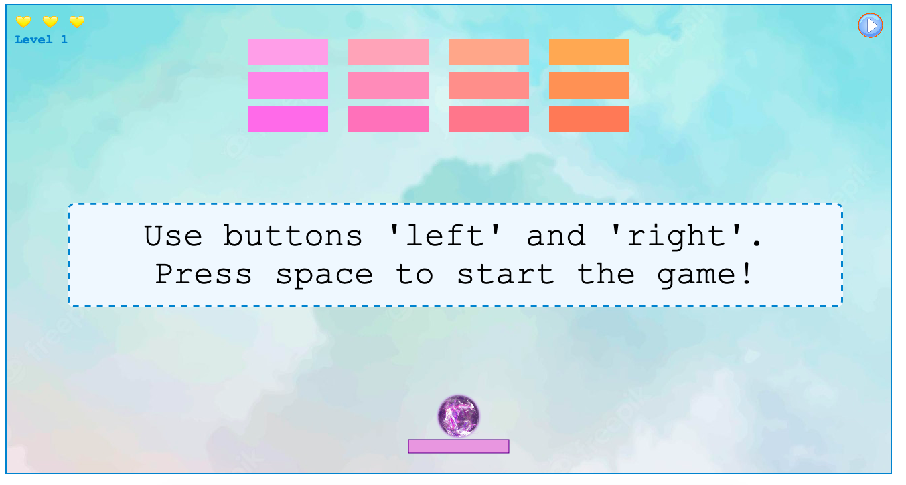

# Breakout game

## Description

There are different colorful rows of bricks at the top of the screen and a ball at the bottom of the screen. The main goal of the game is to eliminate all the bricks by hitting them with the ball. Rebound the ball from the bottom line by moving the bar left and right. When the game starts a player has 3 lives. Every time when the ball rebounds and touches the bottom border of the screen, one life is lost. 

There are three levels in the **Breakout game**. When the player loses all the lives, the progress is gone and the game starts over. 

## How to play

Press:
-  `space` to start the game 
-  `space` to pause the game
-  `space` to continue the game after pausing
-  `←` left button on the keyboard to move the bar left
-  `→` right button on the keyboard to move the bar right

## Motivation

I chose this game as a part of my learning process. This is my first game and through it I intended to use many different tools I have learned. In addition my secondary goal was also to practice more the `canvas` tag in javascript, in order to minimize html and css.

## Supported browsers

The game can be played on most browsers such as Safari, Chrome, Opera etc.

